<h1>Taller 10 - Jaqueline Gonzalez Marentes</h1>

<h2>Información</h2>

Full Stack Basico - Grupo 1 

Cristian Patiño

<h2>Punto 1: Constantes y variables</h2>
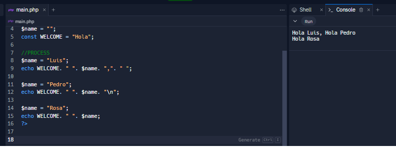

<h2>Punto 2: Sumas de Constantes y variables</h2>
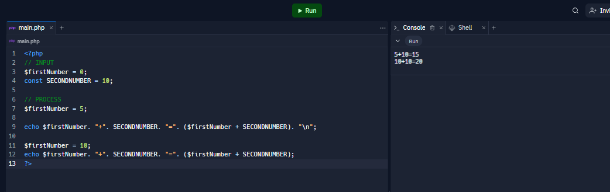

<h2>Punto 3: Sumas de dos números indicados por el usuarios</h2>

<h2>Punto 4: Datos de los usuarios en consola</h2>
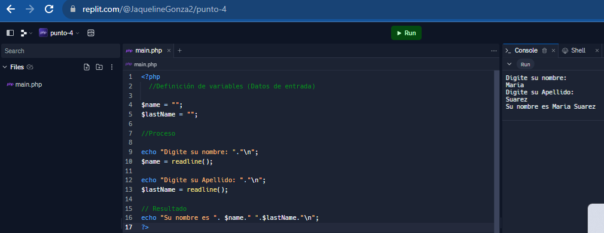

<h2>Punto 5: Entrada de bolera usando IF / Else</h2>
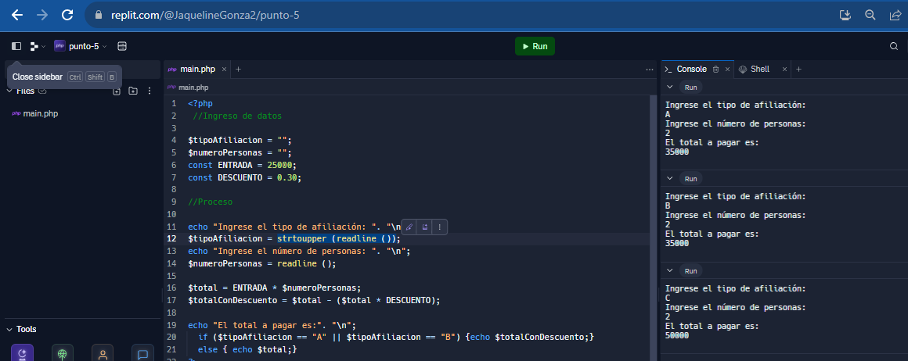

<h2>Punto 6: Detección de mayoria de edad</h2>
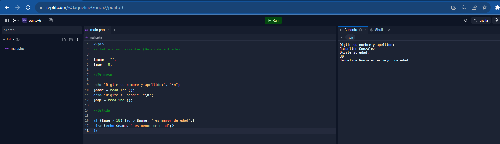

<h2>Punto 7: Selección de operación aritmetica</h2>
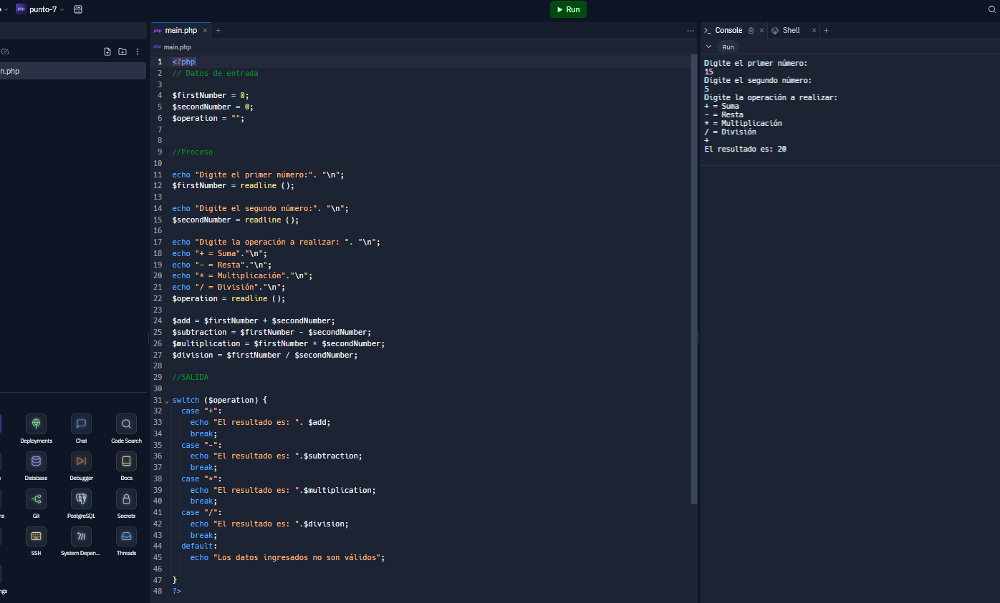

<h2>Punto 8: Entrada a la bolera usando switch</h2>
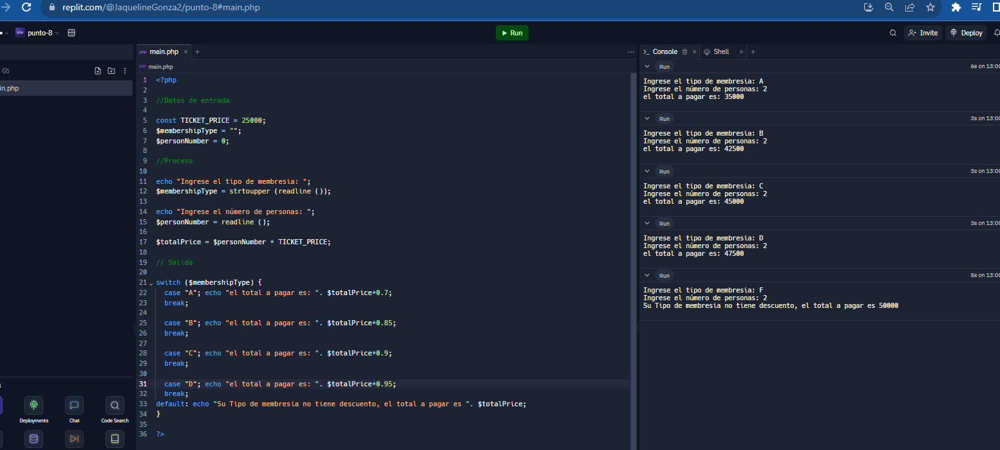

<h2>Punto 9: Tabla de multiplicar usando while</h2>
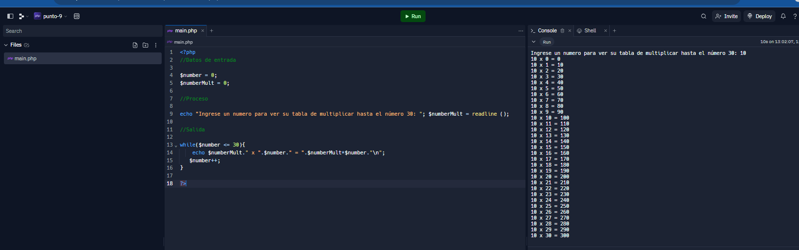

<h2>Punto 10: Números pares usando while</h2>

<h2>Punto 11: Números impares usando For</h2>
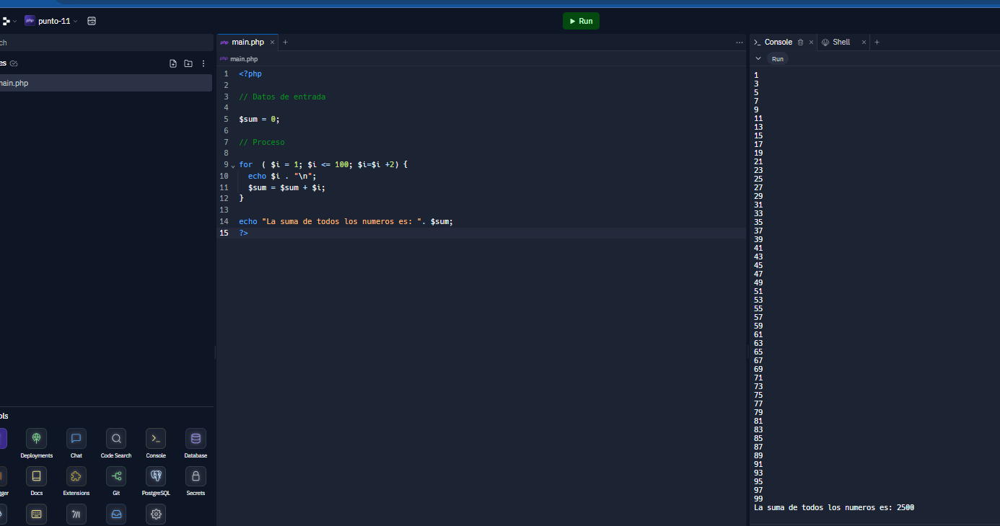

<h2>Punto 12: Tabla de multiplicar usando for</h2>
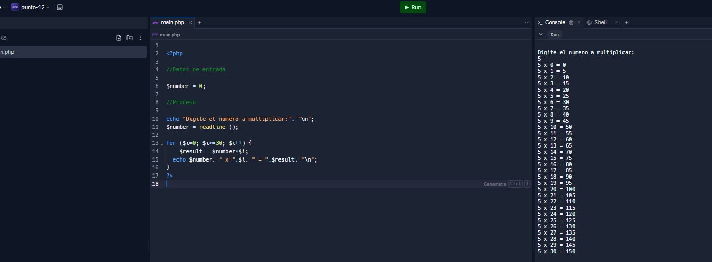

<h2>Punto 13: Suma de valores de un arreglo usando For Each</h2>
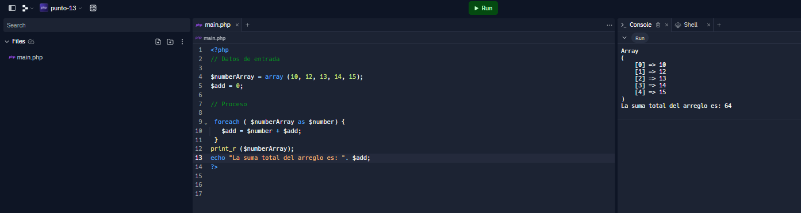

<h2>Punto 14: Revisión de contraseña</h2>
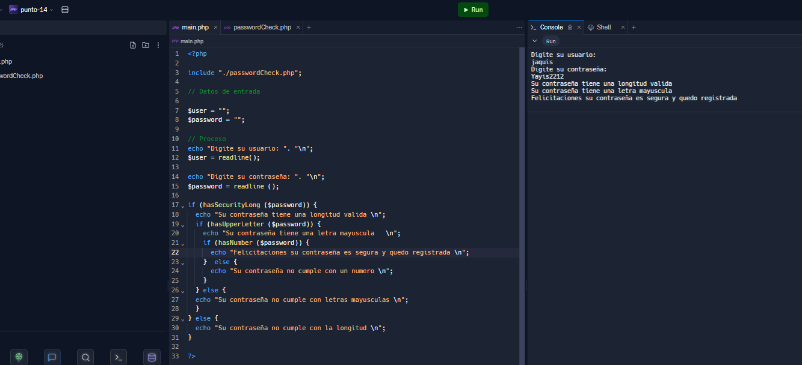
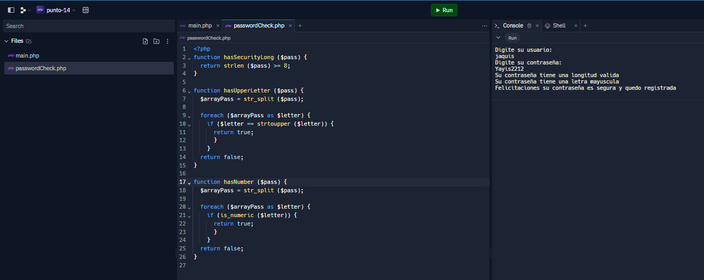

<h2>Punto 15: Selección de operación aritmetica usando funciones</h2>
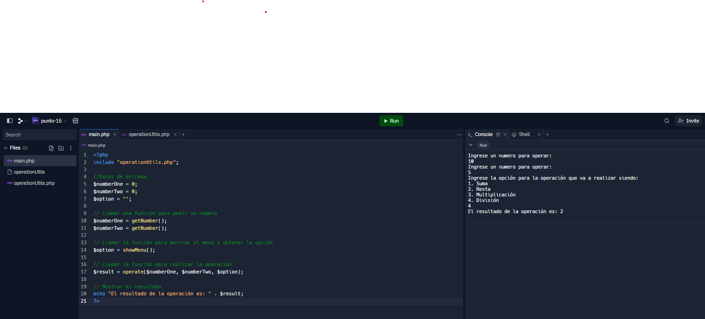
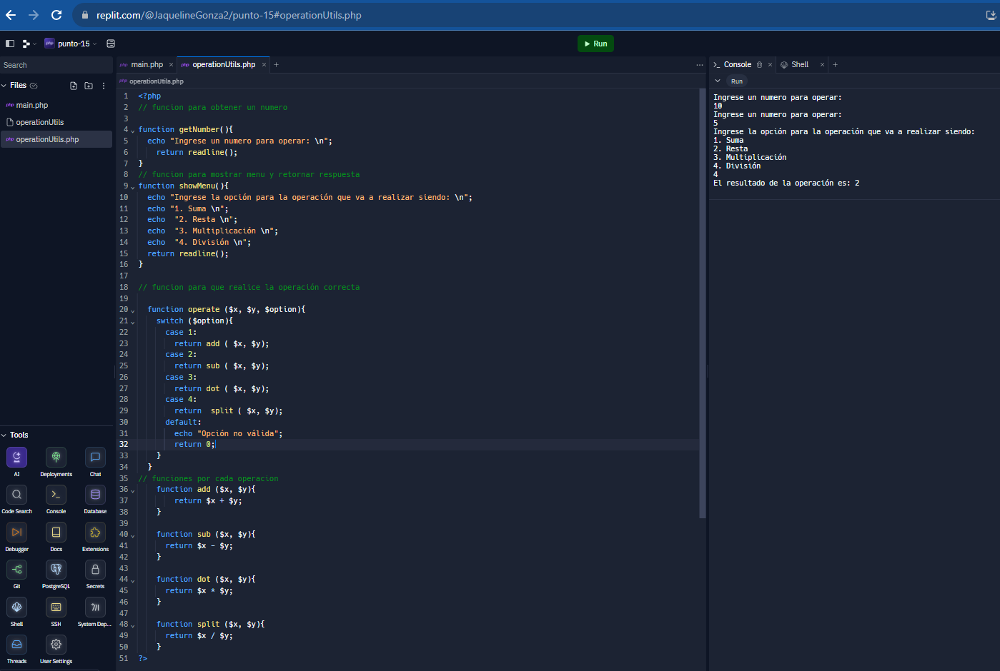